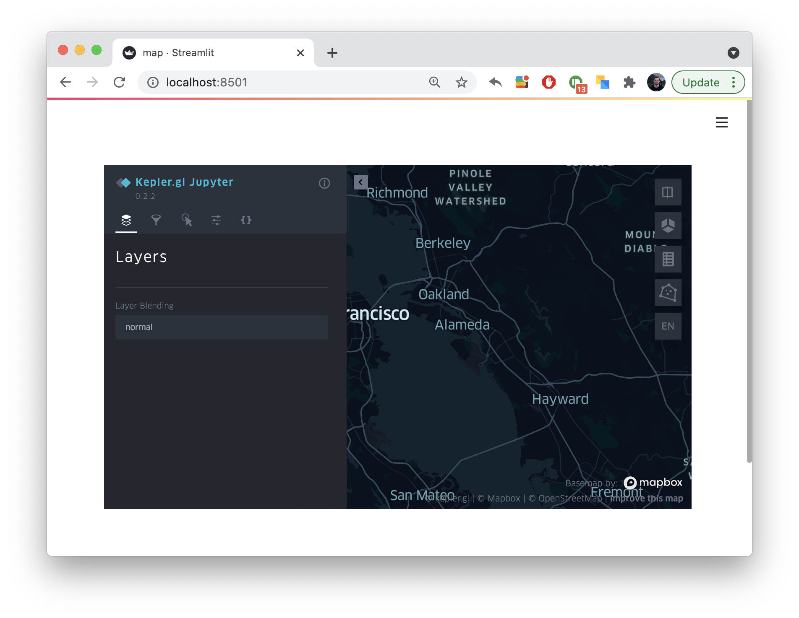

# streamlit-keplergl

[](https://share.streamlit.io/chrieke/streamlit-keplergl/main/examples/streamlit-keplergl-example.py)
[](https://pypi.org/project/streamlit-keplergl/)

**🗾 Streamlit Component for rendering [kepler.gl](https://github.com/keplergl/kepler.gl/tree/master/bindings/kepler.gl-jupyter) maps in a streamlit app.**

---

<h3 align="center">
  🎈 <a href="https://share.streamlit.io/chrieke/streamlit-keplergl/main/examples/streamlit-keplergl-example.py">Live Demo</a> 🎈
</h3>

---

<p align="center">
    </a>
</p>

## Installation

```bash
pip install streamlit-keplergl
```

## How to use it

```python
import streamlit as st
from streamlit_keplergl import keplergl_static
from keplergl import KeplerGl

st.write("This is a kepler.gl map in streamlit")

map_1 = KeplerGl(height=400)
keplergl_static(map_1)
```

## Options

```
fig: keplergl.KeplerGl map figure.
height: Height of result. If height is set on the keplergl.KeplerGl object,
        that value supersedes the values set with the keyword arguments of this
        function.
width: Width of result.
```

